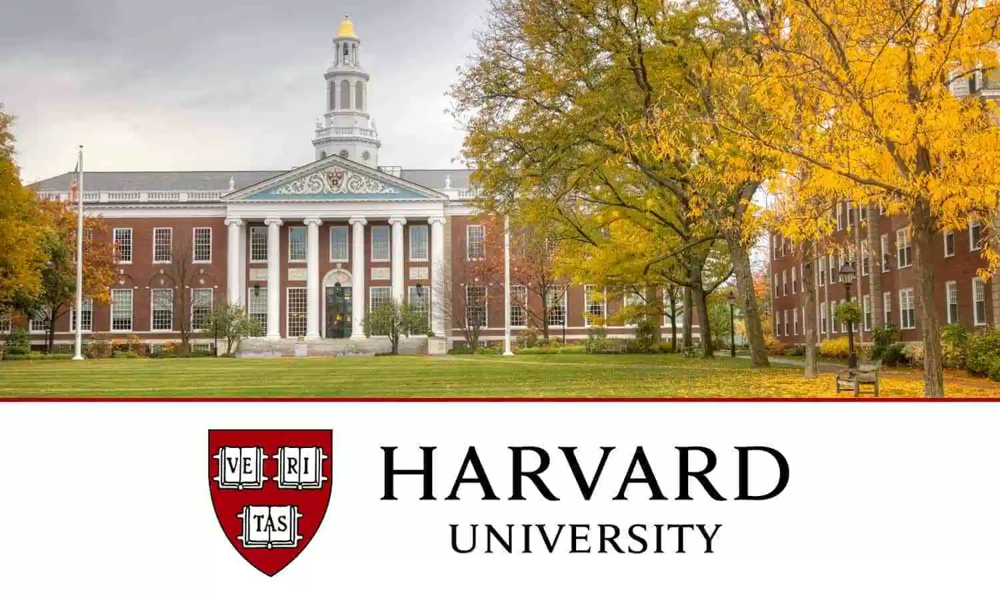

# CS50 - O Curso de Ciência da Computação em Harvard No Brasil

Disponibilizado por: [Fundação Estudar](https://cc50.estudarfora.org.br) 
Traduzido e apresentado por: [Gabriel Lima Guimarães](https://linkedin.com/in/glguimaraes) 
Desenvolvido por: [David Malan](https://linkedin.com/in/malan) 

O CC50 foi idealizado e executado por Gabriel Guimarães, formado em Harvard e assistente de ensino do professor 
David Malan. 
Gabriel ministrou três versões presenciais do curso em Vitória - ES.

Hoje qualquer aluno pode fazer o CC50 à distância, sem sair de casa. O curso pretende ser o mais fiel 
possível - todo o material das aulas e dos Sets de Problemas é traduzido diretamente do material original 
(CS50 2011). Isso significa que você vai aprender tudo que os alunos de Harvard aprenderam. 